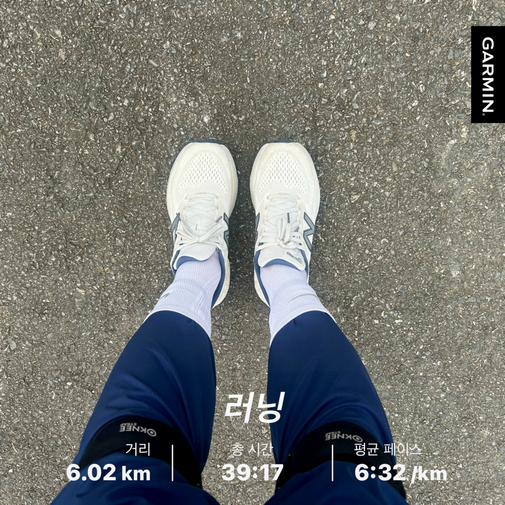

# 2월 연휴의 기록

2월 연휴를 마치기 전에 남기는 기록.

주말과 화요일, 그리고 수요일. 월요일의 출근을 제외하고 4일간의 연휴였음에도 무언가를 명확히 했다고 하기 아쉬운 것들이 많다. 물론 조급하거나 하지 못한 것들 때문에 스트레스를 갖는 것은 아니다. 그럼에도 더 알차게 보내지 못했음에 아쉬움이 남기에 기록으로 무얼 했는지 돌아보고자 한다. 그것은, '넌 아쉽지 않도록 잘 보냈어'라는 나에게 보내는 메세지인 것 같다.

첫날에는 빨래와의 전쟁이었다. 그동안 밀려있던 무수히 많은 빨래들을 하나씩 했다. 두번의 세탁기를 돌리며, 빨래를 했다. 구들 불도 계속 떼면서 집에 온기를 더했다. 멀리나가지는 않았다. 휴식을 하면서 전주에도 다녀왔다. 스타벅스에 가서 잠시라도 계획도 세우고 편안한 상태로 있었다. 집에 와서는 저녁에 장모님댁에 가서 형님네 가족과 밥을 먹었다. 그렇게 저녁시간을 보내고 집에 오니 하루가 끝났다. 

둘째날에는 역시나 빨래를 했다. (연휴의 큰 계획 중 하나가 빨래였다)

그렇게 빨래를 하고 무료하게 집에서 있기만 할 수 없었기에 러닝을 하고 왔다. 오랜만에 혼자 러닝을 하는 것이어서 어디서 뛸까 고민하다가 결국 매번 뛰던 은천리에서 마이산을 뛰었다. 얼마나 뛸 수 있을까 싶어서 5km를 목표로 했었는데 뛰다보니 6km를 뛸 수 있을 것 같아서 좀 더 뛰었다. 

뛰고나면 보람도 있고 상쾌하다. 뛰는 동안 떠오르는 이런저런 생각들, 상황들이 전부인 것 같다가도 한낱 흩어지는 것들이라는 생각으로 변하게 된다. 그리고 내 삶에서 아주 크게 중요한 것은 아닐 거라는 생각으로 결론지어진다. 한결 가벼워지는 것이다. 러닝 후 저녁에는 임실 맘스터치와 이마트에브리데이에 다녀왔다. 저녁 거리를 사서 집에서 맛있게 햄버거와 치킨을 먹으며 행복하게 보냈다. 휴식이다.

월요일의 출근, 그리고 화요일.

화요일이다. 오전 느긋하게 빵과 소세지, 계란후라이를 먹었다. 여유로운 커피와 함께 맞이하는 아침시간이었다. 그 후 전주로 향했다. 빵을 사고 플랫화이트를 먹고자 카페를 갔다. 맛있는 커피를 마셨으나 계획한 강의를 듣거나 공부를 하지는 못했다. 오랜 시간을 보내기에는 부담스러운 공간이었기 때문이다. 그래서 서둘러 나온 후에 러닝을 했다. 전주천을 따라서 뛰었다. 그런데 마이산을 뛰었을 때보다 더 힘이 들었다. 몸은 더 가벼워졌을텐데 이상하게 무거웠다. 그래도 5km를 뛰며 몸과 마음을 비우고자 했다. 

달린 후 장모님댁에 갔다. 잠시 앉아서 대화를 나누고 집에 온 뒤 고기를 먹으로 식당에 갔다. 저녁을 먹고 다시 집에 와서 작업을 한 뒤 이른 취침을 했다. 

연휴의 마지막날, 수요일은 대전에 왔다. 

